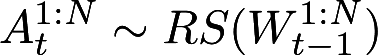
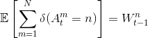
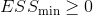
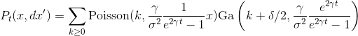

# FeynmanKacParticleFilters


A package to perform particle filtering (and smoothing) written using the Feynman-Kac formalism.

Implemented as an example:
- [Cox-Ingersoll-Ross](https://en.wikipedia.org/wiki/Cox%E2%80%93Ingersoll%E2%80%93Ross_model) (CIR)

Outputs:
- Marginal likelihood
- Samples from the filtering distribution

Implemented:
- Bootstrap particle filter with adaptive resampling.

# Preliminary notions

The Feynman-Kac formalism allows to formulate different types of particle filters using the same abstract elements.
The input of a generic particle filter are:

- A Feynman-Kac model M_t, G_t, where:  
  - G_t is a potential function which can be evaluated for all values of t  
  - It is possible to simulate from M_0(dx0) and M_t(x_t-1, dxt)  
- The number of particles N  
- The choice of an unbiased resampling scheme (e.g. multinomial), i.e. an algorithm to draw variables  in 1:N where RS is a distribution such that: .

For adaptive resampling, one needs in addition:
- a scalar 

Using this formalism, the boostrap filter is expressed as:  
- G_0(x_0) = f_0(y_0|x_0), where f is the emission density
- G_t(x_t-1, x_t) = f_0(y_t|x_t)  
- M_0(dx0) = P_0(dx0) the prior on the hidden state  
- M_t(x_t-1, dxt) = P_t(x_t-1, dxt) given by the transition function


# How to install the package

Press `]` in the Julia interpreter to enter the Pkg mode and input:

```julia
pkg> add https://github.com/konkam/FeynmanKacParticleFilters.jl
```

# How to use the package (Example with the CIR model)
<!-- P_t(x, dx') = \sum_{k \ge 0}\text{Poisson}(k, \frac{\gamma}{\sigma^2}\frac{1}{e^{2\gamma t}-1}x)\text{Ga}\left(k+\delta/2,  \frac{\gamma}{\sigma^2}\frac{e^{2\gamma t}}{e^{2\gamma t}-1}\right ) -->

The transition density of the 1-D CIR process is available as:




We start by simulating some data:

```julia
using FeynmanKacParticleFilters, Distributions, Random

Random.seed!(0)

Δt = 0.1
δ = 3.
γ = 2.5
σ = 4.
Nobs = 2
Nsteps = 4
λ = 1.
Nparts = 10
α = δ/2
β = γ/σ^2

time_grid = [k*Δt for k in 0:(Nsteps-1)]
times = [k*Δt for k in 0:(Nsteps-1)]
X = FeynmanKacParticleFilters.generate_CIR_trajectory(time_grid, 3, δ*1.2, γ/1.2, σ*0.7)
Y = map(λ -> rand(Poisson(λ), Nobs), X);
data = zip(times, Y) |> Dict
```

Now define the (log)potential function Gt and the transition kernel for the Cox-Ingersoll-Ross model:

```julia
Mt = FeynmanKacParticleFilters.create_transition_kernels_CIR(data, δ, γ, σ)
Gt = FeynmanKacParticleFilters.create_potential_functions_CIR(data)
logGt = FeynmanKacParticleFilters.create_log_potential_functions_CIR(data)
RS(W) = rand(Categorical(W), length(W))
```

**References:**

- Chopin, N. & Papaspiliopoulos, O. *A concise introduction to Sequential Monte Carlo*, to appear.
- Del Moral, P. (2004). *Feynman-Kac formulae. Genealogical and interacting particle
systems with applications.* Probability and its Applications. Springer Verlag, New
York.
