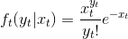

[](https://coveralls.io/github/konkam/FeynmanKacParticleFilters.jl?branch=master)
[](https://codecov.io/gh/konkam/FeynmanKacParticleFilters.jl)
[](https://travis-ci.org/konkam/FeynmanKacParticleFilters.jl)

# FeynmanKacParticleFilters


A package to perform particle filtering (as well as likelihood estimation and smoothing) using the Feynman-Kac formalism.

Filtering and likelihood estimation are illustrated on two stochastic diffusion equation models:
- The [Cox-Ingersoll-Ross](https://en.wikipedia.org/wiki/Cox%E2%80%93Ingersoll%E2%80%93Ross_model) (CIR) model
- The K dimensional continuous Wright Fisher model (continuous time, infinite population, see Jenkins & Spanò (2017) for instance)

*Particle smoothing for the Wright-Fisher model is not implemented for lack of a tractable form of the transition density.*

Outputs:
- Marginal likelihood
- Samples from the filtering distribution
- Samples from the marginal smoothing distribution

Implemented:
- Bootstrap particle filter with adaptive resampling.  
- Forward Filtering Backward Smoothing (FFBS) algorithm
<!-- - Two-filter particle smoother (not ready yet) -->

Potentially useful functions:
- Evaluation of the transition density for the Cox-Ingersoll-Ross process (*based on the representation with the Bessel function*)
- Random trajectory generation from the Cox-Ingersoll-Ross process (*based on the Gamma Poisson expansion of the transition density*)

# Preliminary notions on the Feynman-Kac formalism

The Feynman-Kac formalism allows to formulate different types of particle filters using the same abstract elements.
The input of a generic particle filter are:

- A Feynman-Kac model M_t, G_t, where:  
  - G_t is a potential function which can be evaluated for all values of t  
  - It is possible to simulate from M_0(dx0) and M_t(x_t-1, dxt)  
- The number of particles N  
- The choice of an unbiased resampling scheme (e.g. multinomial), i.e. an algorithm to draw variables  in 1:N where RS is a distribution such that: .

For adaptive resampling, one needs in addition:
- a scalar 

Using this formalism, the boostrap filter is expressed as:  
- G_0(x_0) = f_0(y_0|x_0), where f is the emission density
- G_t(x_t-1, x_t) = f_0(y_t|x_t)  
- M_0(dx0) = P_0(dx0) the prior on the hidden state  
- M_t(x_t-1, dxt) = P_t(x_t-1, dxt) given by the transition function


# How to install the package

Press `]` in the Julia interpreter to enter the Pkg mode and input:

```julia
pkg> add https://github.com/konkam/FeynmanKacParticleFilters.jl
```

# How to use the package (Example with the CIR model)
<!-- P_t(x, dx') = \sum_{k \ge 0}\text{Poisson}(k, \frac{\gamma}{\sigma^2}\frac{1}{e^{2\gamma t}-1}x)\text{Ga}\left(k+\delta/2,  \frac{\gamma}{\sigma^2}\frac{e^{2\gamma t}}{e^{2\gamma t}-1}\right ) -->

The transition density of the 1-D CIR process is available as:


from which it easy to simulate.
Moreover, we consider a Poisson distribution as the emission density:

<!-- f_t(y_t|x_t) = \frac{x_t^{y_t}}{y_t!}e^{-x_t} -->




We start by simulating some data (a function to simulate from the transition density is available in the package):

```julia
using FeynmanKacParticleFilters, Distributions, Random

Random.seed!(0)

Δt = 0.1
δ = 3.
γ = 2.5
σ = 4.
Nobs = 2
Nsteps = 4
λ = 1.
Nparts = 10
α = δ/2
β = γ/σ^2

time_grid = [k*Δt for k in 0:(Nsteps-1)]
times = [k*Δt for k in 0:(Nsteps-1)]
X = FeynmanKacParticleFilters.generate_CIR_trajectory(time_grid, 3, δ*1.2, γ/1.2, σ*0.7)
Y = map(λ -> rand(Poisson(λ), Nobs), X);
data = zip(times, Y) |> Dict

4-element Array{Float64,1}:
 0.0
 0.1
 0.2
 0.30000000000000004
```

## Filtering

Now we define the (log)potential function Gt,  a simulator from the transition kernel for the Cox-Ingersoll-Ross model and a resampling scheme (here multinomial):

```julia
Mt = FeynmanKacParticleFilters.create_transition_kernels_CIR(data, δ, γ, σ)
logGt = FeynmanKacParticleFilters.create_log_potential_functions_CIR(data)
RS(W) = rand(Categorical(W), length(W))
```

Running the boostrap filter algorithm is performed as follows:


```julia
pf = FeynmanKacParticleFilters.generic_particle_filtering_adaptive_resampling_logweights(Mt, logGt, Nparts, RS)
```

To sample `nsamples` values from the i-th filtering distributions, do:

```julia
n_samples = 100
i = 4
FeynmanKacParticleFilters.sample_from_filtering_distributions_logweights(pf, n_samples, i)
100-element Array{Float64,1}:
  5.371960182098351
  5.371960182098351
  3.3924167451813956
  3.3924167451813956
  3.3924167451813956
  ⋮
```

 ## Smoothing

### Forward Filtering Backward Smoothing (FFBS)
 To perform a simple particle smoothing on the CIR process using the FFBS algorithm, we additionally need a function which evaluates the transition density of the CIR process.

 ```julia
 transition_logdensity_CIR(Xtp1, Xt, Δtp1) = FeynmanKacParticleFilters.CIR_transition_logdensity(Xtp1, Xt, Δtp1, δ, γ, σ)
 ```

With the transition density, we can obtain the FFBS filter:

```julia
ps = FeynmanKacParticleFilters.generic_FFBS_algorithm_logweights(Mt, logGt, Nparts, Nparts, RS, transition_logdensity_CIR)
```


To sample `nsamples` values from the i-th smoothing distribution, do:

```julia
n_samples = 100
i = 4
FeynmanKacParticleFilters.sample_from_smoothing_distributions_logweights(ps, n_samples, i)
100-element Array{Float64,1}:
 7.134633585387236
 2.513540876531395
 5.0555536713845814
 7.983322471825221
 4.651221100411266
 ⋮
```

 <!-- ### Two-filter particle smoothing

To perform particle smoothing on the CIR process using the two-filter algorithm, in addition to a tractable for for the transition density, we need a sequence of distributions $\gamma_t$ for t=0:T, such that the Radon-Nikodym derivative \ganna_T/M_0 exists and may be computed pointwise   (we take the prior distribution on the last state for the information filter to be the prior distribution on the first state in the particle filter). Briers et al. (2010) suggest that the invariant density of the CIR process may be used for all distributions in the sequence.

 ```julia
 CIR_invariant_logdensity(X) = FeynmanKacParticleFilters.CIR_invariant_logdensity(X, δ, γ, σ)

 transition_logdensity_CIR(Xtp1, Xt, Δtp1) = FeynmanKacParticleFilters.CIR_transition_logdensity(Xtp1, Xt, Δtp1, δ, γ, σ)
 ```

With these two additional ingredients, we can obtain the two-filter smoother for the CIR process and sample from it:

```julia
ps = FeynmanKacParticleFilters.two_filter_marginal_smoothing_algorithm_adaptive_resampling_logweights(Mt, logGt, 100, RS, transition_logdensity_CIR, CIR_invariant_logdensity)
n_samples = 100
i = 4
FeynmanKacParticleFilters.sample_from_smoothing_distributions_logweights(pf, n_samples, i)
100-element Array{Float64,1}:
 3.3924167451813956
 3.3924167451813956
 5.371960182098351
 3.3924167451813956
 6.181638161092906
 ⋮
``` -->

**References:**
- Briers, M., Doucet, A. and Maskell, S. *Smoothing algorithms for state–space models.* Annals of the Institute of Statistical Mathematics 62.1 (2010): 61.  

- Chopin, N. & Papaspiliopoulos, O. *A concise introduction to Sequential Monte Carlo*, to appear.

- Del Moral, P. (2004). *Feynman-Kac formulae. Genealogical and interacting particle
systems with applications.* Probability and its Applications. Springer Verlag, New York.    

- Jenkins, P. A., & Spanò, D. (2017). Exact simulation of the Wright--Fisher diffusion. The Annals of Applied Probability, 27(3), 1478–1509.
